# Professional DevOps Stack
### Complete Infrastructure Automation Platform


---

## 🌟 Overview

The **Professional DevOps Stack** is a complete, production-ready infrastructure automation platform that deploys a modern DevOps environment with enterprise-grade security. Built with **Infrastructure as Code** principles, it provides everything needed for software development teams to collaborate, build, and deploy applications securely.

### What This Project Does

- **🚀 One-Command Deployment** - Deploy entire DevOps infrastructure with a single command
- **🔒 Security-First Design** - Enterprise security with encrypted secrets, firewall, and intrusion prevention
- **⚡ Production Ready** - Optimized for performance with resource limits and monitoring
- **🌐 Domain Management** - Automatic SSL certificates and subdomain routing
- **📊 Complete Observability** - Logging, monitoring, and service health checks
- **🔧 Developer Friendly** - Easy configuration, clear documentation, and extensible design

---

## 🏗️ Architecture Overview

```mermaid
graph TB
    subgraph "Internet"
        USER[👤 Users]
        DNS[🌐 DNS Provider]
    end

    subgraph "Security Layer"
        UFW[🛡️ UFW Firewall<br/>Ports: 22, 80, 443]
        F2B[🚫 Fail2ban<br/>Intrusion Prevention]
    end

    subgraph "Reverse Proxy Layer"
        TRAEFIK[🌐 Traefik v3.4<br/>Reverse Proxy<br/>SSL Termination]
        LE[🔒 Let's Encrypt<br/>SSL Certificates]
    end

    subgraph "Application Layer"
        subgraph "CI/CD Services"
            JENKINS[⚡ Jenkins LTS<br/>CI/CD Platform<br/>Port: 8080]
            DOCKER[🐳 Docker Engine<br/>Container Runtime]
        end
        
        subgraph "Communication Services"
            MATTERMOST[💬 Mattermost<br/>Team Chat<br/>Port: 8065]
            POSTGRES[🗄️ PostgreSQL 17<br/>Database]
        end
    end

    subgraph "Storage Layer"
        VOLUMES[💾 Docker Volumes<br/>Persistent Data]
        CONFIG[📁 Configuration Files<br/>/opt/project-name/]
    end

    subgraph "Automation Layer"
        ANSIBLE[🤖 Ansible<br/>Infrastructure as Code]
        VAULT[🔐 Ansible Vault<br/>Encrypted Secrets]
    end

    %% User Flow
    USER --> DNS
    DNS --> UFW
    UFW --> F2B
    F2B --> TRAEFIK

    %% SSL Certificate Flow
    TRAEFIK <--> LE

    %% Service Routing
    TRAEFIK --> JENKINS
    TRAEFIK --> MATTERMOST

    %% Data Flow
    JENKINS --> DOCKER
    MATTERMOST --> POSTGRES

    %% Storage
    JENKINS --> VOLUMES
    MATTERMOST --> VOLUMES
    POSTGRES --> VOLUMES

    %% Configuration
    ANSIBLE --> CONFIG
    VAULT --> ANSIBLE

    %% Styling
    classDef security fill:#ff6b6b,stroke:#d63447,stroke-width:2px,color:#fff
    classDef proxy fill:#4ecdc4,stroke:#45b7aa,stroke-width:2px,color:#fff
    classDef app fill:#45b7d1,stroke:#2196F3,stroke-width:2px,color:#fff
    classDef data fill:#96ceb4,stroke:#81c784,stroke-width:2px,color:#fff
    classDef automation fill:#ffeaa7,stroke:#fdcb6e,stroke-width:2px,color:#333

    class UFW,F2B security
    class TRAEFIK,LE proxy
    class JENKINS,MATTERMOST,DOCKER,POSTGRES app
    class VOLUMES,CONFIG data
    class ANSIBLE,VAULT automation
```



### Service Architecture Details

| Component | Technology | Purpose | Access URL |
|-----------|------------|---------|------------|
| **🌐 Reverse Proxy** | Traefik v3.4 | SSL termination, routing, load balancing | `https://traefik.yourdomain.com` |
| **⚡ CI/CD Platform** | Jenkins LTS | Continuous integration & deployment | `https://cicd.yourdomain.com` |
| **💬 Team Communication** | Mattermost Team Edition | Team collaboration & notifications | `https://chat.yourdomain.com` |
| **🗄️ Database** | PostgreSQL 17 | Data persistence for Mattermost | Internal only |
| **🐳 Container Runtime** | Docker Engine + Compose | Application containerization | Internal only |
| **🛡️ Security** | UFW + Fail2ban | Network security & intrusion prevention | System level |

---

## 🚀 Quick Start Guide

### Prerequisites

| Requirement | Version | Notes |
|-------------|---------|--------|
| **Server** | Ubuntu 20.04+ | 6GB RAM, 50GB storage, root access |
| **Domain** | Valid domain | DNS management access required |
| **Control Machine** | Ansible 2.9+ | Python 3.8+, SSH key access |

### 1. Project Setup

```bash
# Clone the repository
git clone <your-repo-url>
cd devops-stack

# Install Ansible collections
make install

# Create configuration files from templates
cp inventory/hosts.yml.example inventory/hosts.yml
cp group_vars/vault.yml.example group_vars/vault.yml
```

### 2. Server Configuration

Edit your server details in `inventory/hosts.yml`:

```yaml
devops_servers:
  hosts:
    your-server:
      ansible_host: 192.168.1.100              # Your server IP
      ansible_user: admin                      # Your SSH username
      ansible_ssh_private_key_file: ~/.ssh/id_rsa  # Your SSH key
```

### 3. Project Configuration

Edit `group_vars/vault.yml` with your settings:

```yaml
# Project details
vault_project_name: "acme-devops"
vault_organization: "ACME Corporation"
vault_domain: "acme.com"
vault_ssl_email: "admin@acme.com"

# Generate secure passwords (use: openssl rand -base64 32 | tr -d "=+/" | cut -c1-25)
vault_traefik_admin_password: "your-secure-password"
vault_jenkins_admin_password: "your-secure-password"
vault_db_password: "your-secure-db-password"
```

### 4. Security Setup

```bash
# Encrypt sensitive configuration
ansible-vault encrypt group_vars/vault.yml

# Test connectivity
make ping

# Deploy the complete stack
make deploy
```

### 5. DNS Configuration

Point these subdomains to your server IP:
- `traefik.yourdomain.com` → Server IP
- `cicd.yourdomain.com` → Server IP  
- `chat.yourdomain.com` → Server IP

---

## 📋 Component Details

### 🌐 Traefik Reverse Proxy

**Purpose**: Central entry point for all services with automatic SSL certificates

**Features**:
- Automatic Let's Encrypt SSL certificates
- HTTP to HTTPS redirection
- Service discovery via Docker labels
- Security headers and protection
- Web dashboard for monitoring

**Configuration**:
- Static config: `/opt/project-name/config/traefik/traefik.yml`
- Dynamic config: `/opt/project-name/config/traefik/dynamic/`
- SSL certificates: `/opt/project-name/config/traefik/acme.json`

### ⚡ Jenkins CI/CD

**Purpose**: Continuous integration and deployment platform

**Features**:
- Jenkins LTS with Docker support
- Pipeline as Code capabilities
- Plugin ecosystem
- Secure credential management
- Integration with version control

**Initial Setup**:
1. Navigate to `https://cicd.yourdomain.com`
2. Use initial admin password from deployment output
3. Install suggested plugins
4. Create admin user
5. Configure your first pipeline

**Docker Integration**:
- Docker socket mounted for container builds
- Docker CLI available inside Jenkins
- Support for Docker Compose deployments

### 💬 Mattermost Team Communication

**Purpose**: Team collaboration and DevOps notifications

**Features**:
- Team messaging and file sharing
- Bot integrations and webhooks
- Jenkins build notifications
- Mobile and desktop apps
- PostgreSQL backend for reliability

**Setup Process**:
1. Navigate to `https://chat.yourdomain.com`
2. Create system admin account
3. Set up teams and channels
4. Configure Jenkins webhook integration
5. Set up notification preferences

### 🗄️ PostgreSQL Database

**Purpose**: Reliable data storage for Mattermost

**Features**:
- PostgreSQL 17 Alpine (lightweight)
- Persistent data volumes
- Automated backups (optional)
- Performance optimized settings

**Management**:
- Access via Mattermost application
- Database dumps via Docker exec
- Monitoring via application logs

---

## 🔒 Security Features

### Multi-Layer Security Architecture

```mermaid
graph TB
    subgraph "Security Layers"
        L1[🌐 DNS & Domain Validation]
        L2[🛡️ UFW Firewall<br/>Port Filtering]
        L3[🚫 Fail2ban<br/>Intrusion Prevention]
        L4[🔒 SSL/TLS Encryption<br/>Let's Encrypt]
        L5[🔐 Application Security<br/>Authentication & Authorization]
        L6[🗄️ Data Security<br/>Encrypted Storage]
    end

    L1 --> L2
    L2 --> L3
    L3 --> L4
    L4 --> L5
    L5 --> L6

    classDef security fill:#ff6b6b,stroke:#d63447,stroke-width:2px,color:#fff
    class L1,L2,L3,L4,L5,L6 security
```



### Security Implementation

| Security Layer | Technology | Configuration |
|----------------|------------|---------------|
| **Secrets Management** | Ansible Vault | AES256 encryption for all sensitive data |
| **Network Security** | UFW Firewall | Only ports 22, 80, 443 open |
| **Intrusion Prevention** | Fail2ban | SSH brute force protection |
| **Transport Security** | Let's Encrypt | Automatic SSL certificate management |
| **Application Security** | Basic Auth | Protected dashboards and admin interfaces |
| **Container Security** | Non-root containers | Resource limits and security contexts |

### Security Best Practices

✅ **Template-based Configuration** - No hardcoded secrets in code
✅ **Encrypted Storage** - All passwords encrypted with Ansible Vault
✅ **Minimal Attack Surface** - Only necessary ports exposed
✅ **Automatic Updates** - Security patches applied automatically
✅ **Strong Authentication** - Complex passwords and secure defaults
✅ **Container Isolation** - Services run in isolated containers

---

## 🛠️ Usage Examples

### Daily Operations

```bash
# Check service status
make status

# View service logs
make logs-jenkins
make logs-mattermost
make logs-traefik

# Restart services
make restart-services

# Update system packages
make update-system

# Security audit
make security-audit
```

### Development Workflows

#### Setting up a CI/CD Pipeline

1. **Create Jenkins Pipeline**:
   ```groovy
   pipeline {
       agent any
       stages {
           stage('Build') {
               steps {
                   sh 'docker build -t myapp .'
               }
           }
           stage('Test') {
               steps {
                   sh 'docker run --rm myapp npm test'
               }
           }
           stage('Deploy') {
               steps {
                   sh 'docker-compose up -d'
               }
           }
       }
       post {
           always {
               // Send notification to Mattermost
               mattermostSend color: 'good', 
                             message: "Build ${currentBuild.displayName} completed",
                             endpoint: 'https://chat.yourdomain.com/hooks/...'
           }
       }
   }
   ```

2. **Configure Mattermost Webhook**:
   - Go to Mattermost → Integrations → Incoming Webhooks
   - Create webhook for your channel
   - Add webhook URL to Jenkins pipeline

#### Adding New Services

To add a new service to the stack:

1. **Update Docker Compose template** (`roles/*/templates/*.yml.j2`)
2. **Add Traefik labels** for routing
3. **Configure firewall rules** if needed
4. **Deploy changes**: `make deploy`

### Backup and Recovery

```bash
# Manual backup
docker exec postgres pg_dump -U admin mattermost > backup.sql
docker exec jenkins tar -czf - /var/jenkins_home > jenkins-backup.tar.gz

# Restore from backup
docker exec -i postgres psql -U admin mattermost < backup.sql
docker exec -i jenkins tar -xzf - -C /var/jenkins_home < jenkins-backup.tar.gz
```

---

## 🎛️ Configuration Reference

### Environment Variables

| Variable | Purpose | Example |
|----------|---------|---------|
| `vault_project_name` | Project identifier | `"acme-devops"` |
| `vault_organization` | Company name | `"ACME Corp"` |
| `vault_domain` | Base domain | `"acme.com"` |
| `vault_environment` | Deployment stage | `"production"` |

### Resource Limits

Default resource limits (configurable in vault):

```yaml
# CPU and Memory limits
vault_traefik_cpu_limit: "0.5"      # 50% of 1 CPU core
vault_traefik_memory_limit: "512m"   # 512MB RAM

vault_jenkins_cpu_limit: "2.0"      # 2 CPU cores
vault_jenkins_memory_limit: "2g"     # 2GB RAM

vault_mattermost_cpu_limit: "1.0"   # 1 CPU core
vault_mattermost_memory_limit: "2g"  # 2GB RAM
```

### Service Ports

| Service | Internal Port | External Access |
|---------|---------------|-----------------|
| Traefik Dashboard | 8080 | `https://traefik.domain.com` |
| Jenkins | 8080 | `https://cicd.domain.com` |
| Mattermost | 8065 | `https://chat.domain.com` |
| PostgreSQL | 5432 | Internal only |

---

## 🐛 Troubleshooting

### Common Issues

#### 🔧 Connection Issues

**Problem**: Cannot connect to services
**Solutions**:
```bash
# Check DNS resolution
nslookup cicd.yourdomain.com

# Verify SSL certificates
curl -I https://cicd.yourdomain.com

# Check Traefik routing
make logs-traefik
```

#### 🔧 SSL Certificate Issues

**Problem**: SSL certificate not generated
**Solutions**:
```bash
# Check Let's Encrypt rate limits
# Verify domain DNS points to server
# Check Traefik logs for ACME errors
docker logs traefik | grep -i acme
```

#### 🔧 Jenkins Setup Issues

**Problem**: Jenkins initial password not found
**Solutions**:
```bash
# Get initial password manually
docker exec jenkins cat /var/jenkins_home/secrets/initialAdminPassword

# Reset Jenkins if needed
docker exec jenkins rm /var/jenkins_home/config.xml
docker restart jenkins
```

#### 🔧 Database Connection Issues

**Problem**: Mattermost cannot connect to PostgreSQL
**Solutions**:
```bash
# Check PostgreSQL status
docker logs postgres

# Verify network connectivity
docker exec mattermost ping postgres

# Check database credentials in logs
docker logs mattermost | grep -i database
```

### Debug Commands

```bash
# Full deployment with verbose output
make debug-full

# Check service health
docker ps --format "table {{.Names}}\t{{.Status}}\t{{.Ports}}"

# Network inspection
docker network inspect devops-stack_network

# Volume inspection
docker volume ls
docker volume inspect devops-stack_jenkins_data
```

### Service Recovery

If services fail to start:

```bash
# Stop all services
cd /opt/your-project-name
docker compose -f traefik-compose.yml down
docker compose -f cicd-compose.yml down

# Clean up and restart
docker system prune -f
make deploy
```

---

## 📈 Monitoring and Maintenance

### Health Checks

The system includes built-in health monitoring:

```bash
# Service status overview
make status

# Individual service logs
docker logs traefik --tail 50
docker logs jenkins --tail 50
docker logs mattermost --tail 50
docker logs postgres --tail 50

# System resource usage
docker stats
```

### Performance Monitoring

Monitor key metrics:

- **CPU Usage**: Should be below 80% under normal load
- **Memory Usage**: Services should stay within configured limits
- **Disk Usage**: Monitor `/opt/project-name` and Docker volumes
- **Network**: Monitor SSL certificate expiry and connectivity

### Maintenance Tasks

#### Daily
- Check service logs for errors
- Monitor resource usage
- Verify backup processes

#### Weekly
- Review security logs
- Update system packages: `make update-system`
- Clean up Docker resources: `docker system prune`

#### Monthly
- Review and rotate passwords
- Update service configurations
- Plan capacity upgrades if needed

---

## 🤝 Contributing

We welcome contributions! Please follow these guidelines:

### Development Workflow

1. **Fork the repository**
2. **Create a feature branch**: `git checkout -b feature/amazing-feature`
3. **Test your changes** with a development environment
4. **Follow security guidelines** (no hardcoded secrets)
5. **Submit a pull request** with detailed description

### Security Guidelines

🚨 **Critical**: Never commit real credentials or configurations

- Always use template files with placeholders
- Test with dummy data only
- Use Ansible Vault for any secrets
- Document security implications of changes

### Code Standards

- Use descriptive variable names
- Comment complex configurations
- Follow Ansible best practices
- Include error handling

---

## 📄 License

This project is licensed under the MIT License - see the [LICENSE](LICENSE) file for details.

---

## 🙏 Acknowledgments

- **Security Focus**: Built with security-first principles
- **Community**: Thanks to the open-source community for the underlying technologies
- **Best Practices**: Follows infrastructure as code and DevOps best practices

---

## 📞 Support

- **Issues**: Report bugs and request features via GitHub Issues
- **Documentation**: Check the `/docs` directory for detailed guides
- **Community**: Join our discussions for help and sharing

**Built with ❤️ for Professional Software Development Teams**
